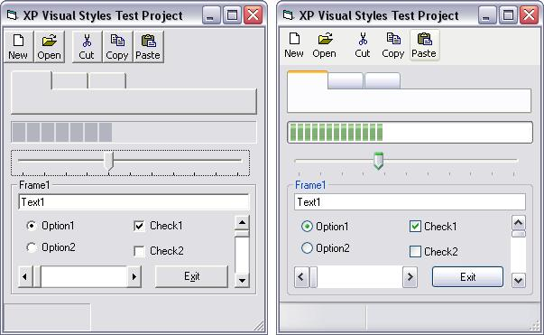



## XP Manifest Inserter

### Description

Windows XP ships with Common Controls version 5 and version 6. By default all windows apps use version 5. In order to force your app to use version 6 your application must have a manifest. It must also correctly call InitCommonControls().

A manifest is a text file with an xml script similar to this:

----

<?xml version="1.0" encoding="UTF-8" standalone="yes"?>

<assembly xmlns="urn:schemas-microsoft-com:asm.v1" manifestVersion="1.0">

<assemblyIdentity

version="1.0.0.0"

processorArchitecture="X86"

name="Your.App.Name"

type="win32"

/>

<description>Your App Description</description>

<dependency>

<dependentAssembly>

<assemblyIdentity

type="win32"

name="Microsoft.Windows.Common-Controls"

version="6.0.0.0"

processorArchitecture="X86"

publicKeyToken="6595b64144ccf1df"

language="*"

/>

</dependentAssembly>

</dependency>

</assembly>

----

If your application is called 'MyApp.exe' then in the same directory you must have a manifest file called 'MyApp.exe.manifest' otherwise WinXP will use common controls v5.

Instead of having a seperate manifest file, this project inserts the manifest into the executable file, and therefore, safeguards the manifest file from deletion or corruption.
 
### More Info
 

             |
---                |---
**Submitted On**   |2001-12-21 16:56:56
**By**             |[Mick Doherty](https://github.com/Planet-Source-Code/PSCIndex/blob/master/ByAuthor/mick-doherty.md)
**Level**          |Intermediate
**User Rating**    |4.2 (21 globes from 5 users)
**Compatibility**  |VB 6\.0
**Category**       |[Miscellaneous](https://github.com/Planet-Source-Code/PSCIndex/blob/master/ByCategory/miscellaneous__1-1.md)
**World**          |[Visual Basic](https://github.com/Planet-Source-Code/PSCIndex/blob/master/ByWorld/visual-basic.md)
**Archive File**   |[XP\_Manifes4341912212001\.zip](https://github.com/Planet-Source-Code/mick-doherty-xp-manifest-inserter__1-29953/archive/master.zip)

